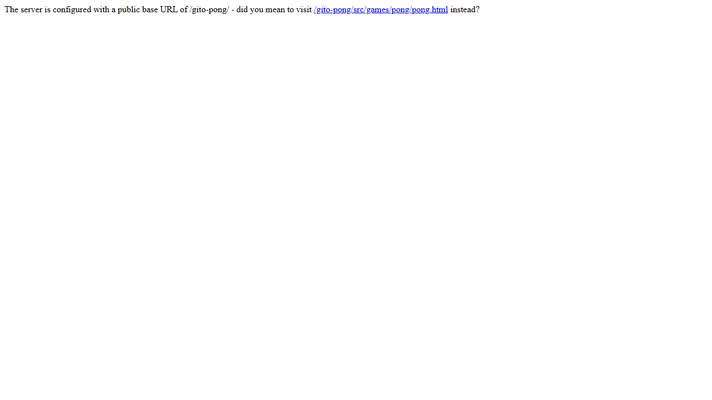
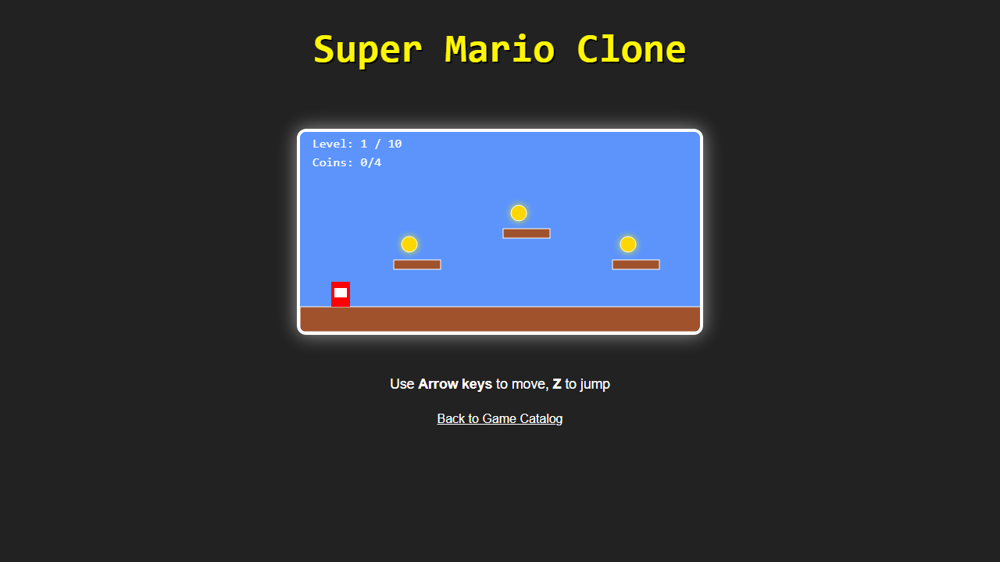
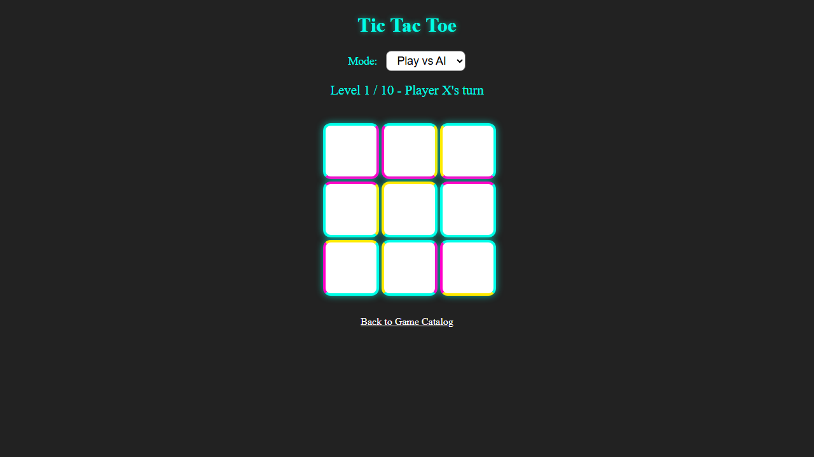
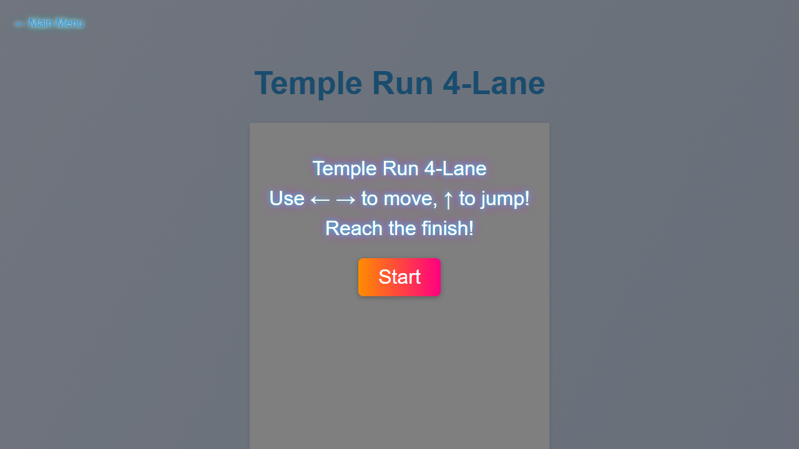

# Vite Pong Game

[](https://github.com/sabitertan/gito-pong/actions/workflows/deploy.yml)

A modern, beginner-friendly Pong clone built with vanilla JavaScript and Vite. Play through 10 levels with increasing AI difficulty, glowing 80s-style prompts, and chiptune music!

---

## 🚀 Play Now
[Play the game on GitHub Pages!](https://sabitertan.github.io/gito-pong/)

---

## Screenshots & Demo




**Gameplay Animation:**


---

## Features
- Dynamic play area (50% of screen)
- Oval paddles, animated ball, visible walls
- 10 levels, increasing AI and ball speed
- 80s-style chiptune music and sound effects
- Fun, glowing prompts and overlays
- Playful, colorful UI
- All logic in `src/main.js`, styles in `src/style.css`

## Getting Started

1. **Install dependencies:**
   ```bash
   npm install
   ```
2. **Start the development server:**
   ```bash
   npm run dev
   ```
3. **Open your browser:**
   Visit [http://localhost:5173](http://localhost:5173)

## Project Structure
- `index.html`: Main HTML file
- `src/main.js`: Game logic
- `src/style.css`: Game styles
- `tests/`: Playwright E2E tests
- `screenshots/`: Images and GIFs for README

## Testing
Run all Playwright E2E tests:
```bash
npx playwright test
```

## 🕹️ Game Catalog Screenshots

| Pong | Super Mario | Tic Tac Toe | Temple Run 4-Lane |
|---|---|---|---|
|  |  |  |  |

---

Happy coding!
